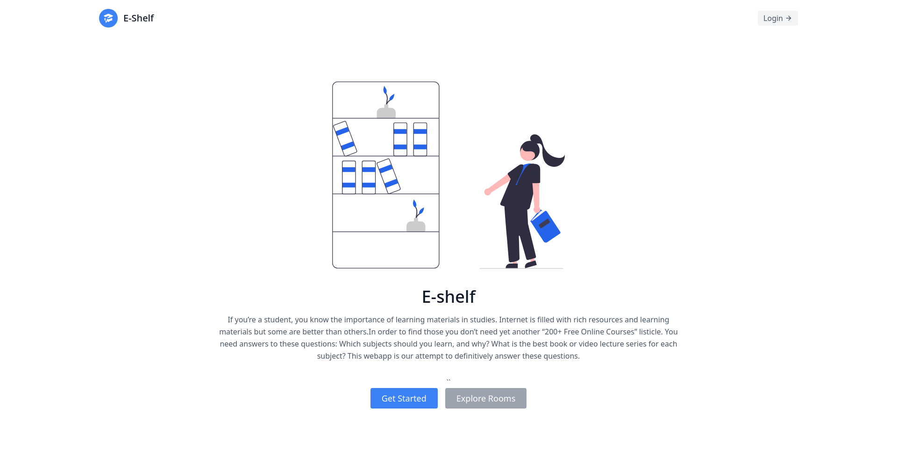

# E-Shelf

### Yet another repo for your study materials!



## Setup

The first thing to do is to clone the repository:

```sh
$ git clone https://github.com/rijfas/E-shelf.git
$ cd E-shelf
```

Create a virtual environment to install dependencies in and activate it:

```sh
$ python -m venv env
$ source env/bin/activate
```

Then install the dependencies:

```sh
(E-shelf)$ pip install -r requirements.txt
```

Note the `(env)` in front of the prompt. This indicates that this terminal
session operates in a virtual environment set up by `virtualenv2`.

Once `pip` has finished downloading the dependencies:

create databse using

```sh
(E-shelf)$ python manage.py migrate
```

Then run the server using

```sh
(E-shelf)$ python manage.py runserver
```

And navigate to `http://127.0.0.1:8000/`.
